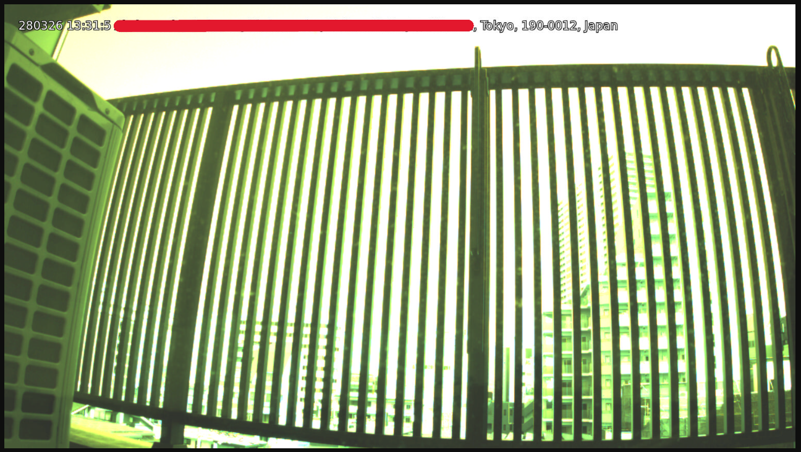

# BeaglePlay GNSS & IMX708 Streaming Server



## 概要 (Overview)
本プロジェクトは、C言語で独自開発された低遅延なカメラストリーミング・GNSS連携サーバです。
CSI-2インターフェース経由で接続されたIMX708カメラモジュールから生の映像データを取得し、I2C経由で取得したGNSS（位置情報）データをリアルタイムに統合して、TCPソケット経由でネットワーク配信します。

Yocto Projectを用いたカスタムBSPに統合されており、`systemd` によってOS起動時に自動で立ち上がる堅牢なデーモン（バックグラウンドサービス）として動作します。

## 主な特徴 (Features)
* **ハードウェア直叩きの低遅延処理:** UVC（USBカメラ）のオーバーヘッドを排除し、V4L2とGStreamerライブラリを用いてIMX708（CSIカメラ）の性能を限界まで引き出します。
* **センサーフュージョン:** 映像ストリームに対し、I2Cから取得したGNSSの緯度・経度情報をリアルタイムで連携させます。
* **高い耐障害性 (systemd Watchdog):** `systemd` によるプロセス監視 (`Restart=always`) により、万が一プロセスがクラッシュした場合でも自動的にサービスが復旧します。
* **Yocto BSP完全統合:** BitBakeレシピ (`.bb`) としてパッケージ化されているため、OSイメージのビルドと同時にシステムへ組み込まれます。

## システムアーキテクチャ (Architecture)
* **Target Board:** BeaglePlay
* **Camera:** SONY IMX708 (MIPI CSI-2)
* **Sensor:** GNSS Receiver (I2C: `/dev/i2c-3`)
* **Core Language:** C / C++
* **Init System:** systemd (`camera-server.service`)
* **Build System:** Yocto Project (BitBake)

## 構成ファイル (Project Structure)
```text
meta-beagleplay-custom/
└── recipes-apps/
    ├── gnss7/                  # GNSSデータ取得用共有ライブラリ (libgnss.so)
    ├── imx708/                 # カメラ制御用共有ライブラリ (libimx708.so)
    └── camera-server/
        ├── files/
        │   ├── camera_streaming_server.c  # メインプロセス
        │   └── camera-server.service      # systemd ユニットファイル
        └── camera-server_1.0.bb           # メインアプリのYoctoレシピ
